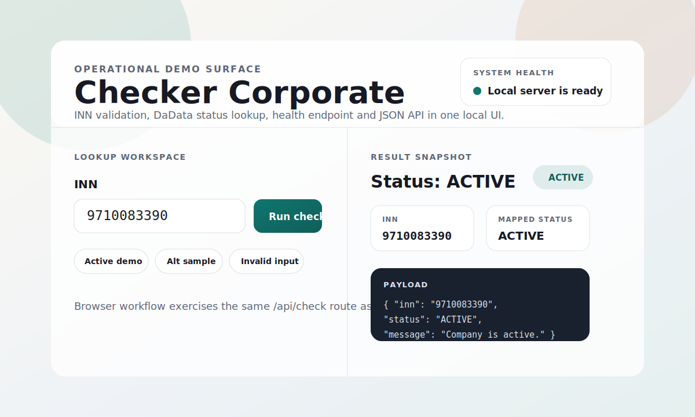

# Checker Corporate

[](https://github.com/krotname/CompanyStatusChecker/actions/workflows/ci.yml)
[](https://github.com/krotname/CompanyStatusChecker/actions/workflows/mutation-testing.yml)
[](https://github.com/krotname/CompanyStatusChecker/actions/workflows/codeql.yml)
[](https://securityscorecards.dev/viewer/?uri=github.com/krotname/CompanyStatusChecker)
[](https://codecov.io/gh/krotname/CompanyStatusChecker)
[](https://github.com/krotname/CompanyStatusChecker/releases)
[](LICENSE)
[](https://openjdk.org/projects/jdk/21/)



## RU

### Что это
`Checker Corporate` — это демонстрационный Java-сервис для валидации ИНН юрлица и проверки его статуса через DaData API. Проект показывает практический подход к:

- валидации входных данных до сетевых вызовов;
- устойчивой обработке интеграционных ошибок;
- выделению доменной модели (`CheckResult`, `CompanyStatus`);
- предоставлению CLI и HTTP UI;
- автоматизации качества через GitHub Actions.

### Что внутри

- `com.krotname.checker.validation` — проверка ИНН и контрольных сумм.
- `com.krotname.checker.client` — HTTP-клиент и парсер ответа DaData.
- `com.krotname.checker.config` — безопасная загрузка конфигурации.
- `com.krotname.checker.ui` — HTTP-сервер (`/`, `/health`, `/api/check`).
- `src/main/resources/static/index.html` — dashboard-style UI для ручной проверки и визуального демо.

Подробные материалы для ревью: [architecture](docs/architecture.md), [quality gates](docs/quality-gates.md), [OpenAPI](docs/openapi.yaml).

### Запуск

1. Установить Java 21.
2. Подготовить токен:

```bash
cp src/main/resources/checker.example.properties src/main/resources/checker.properties
# token=<Ваш токен DADATA>
```

или:

```bash
set DADATA_TOKEN=your_token   # Windows
export DADATA_TOKEN=your_token # macOS/Linux
```

На Windows используйте `mvnw.cmd` вместо `./mvnw`.

#### CLI

```bash
./mvnw -q -DskipTests package
java -jar target/checker-corporate-*.jar 9710083390
```

#### Веб UI

```bash
./mvnw -q -DskipTests package
java -jar target/checker-corporate-*.jar --server 8080
```

Откройте `http://localhost:8080`.

### API

- `GET /health` — health-check для автоматизации.
- `GET /api/check?inn=<ИНН>` — статус компании.
Оба endpoint соответствуют `docs/openapi.yaml`.

Пример ответа:

```json
{
  "inn": "9710083390",
  "status": "ACTIVE",
  "dadataStatus": "ACTIVE",
  "message": "Организация активна."
}
```

### Docker

```bash
./mvnw -q -DskipTests package
docker compose up --build
```

Откройте `http://localhost:8080`.

### UI surface

- Встроенный dashboard с состоянием сервиса, быстрыми сценариями и структурированным выводом результата.
- JSON можно копировать прямо из браузерного UI.
- Встроенный health ping показывает готовность локального сервера без внешних инструментов.

### Тестовая стратегия

- **Unit**: валидация ИНН, маппинг статусов DaData, конфигурация, доменные фабрики.
- **Интеграционные**: HTTP-клиент DaData с локальным тестовым сервером + маршруты API.
- **UI**: smoke-проверки `/`, `/api/check`, `/health`, включая ошибки валидации.
- **Contract/через интеграционный слой**: формат `DadataResponseParser` и поведение `CheckerCorporate.check`.

Классификация тестов:

- `@Tag("unit")` — изолированные и доменные проверки.
- `@Tag("integration")` — интеграции с HTTP-клиентом и HTTP API.
- `@Tag("ui")` — интеграционные проверки поведения пользовательского API.
- `@Tag("contract")` — проверки внешнего JSON/OpenAPI контракта.

Запуск выборочно по профилям:

```bash
./mvnw -q test                           # все тесты
./mvnw -q test -Punit-tests              # только unit
./mvnw -q test -Pintegration-tests       # только интеграционные (включая ui)
./mvnw -q test -Pui-tests                # только UI/API smoke
./mvnw -q test -Pcontract-tests          # только contract
./mvnw -q verify -Pmutation-tests        # mutation testing gate
```

### Качество и автоматизация

- `CI` (`.github/workflows/ci.yml`) — `./mvnw verify`.
- `CI` отдельно запускает `unit`, `integration`, `ui` и `contract` test jobs с публикацией Surefire reports.
- Docker image build + `/health` smoke test in CI.
- `JaCoCo` с минимальным порогом покрытия `LINE >= 0.80`.
- `PIT` mutation testing с минимальным порогом `mutationThreshold >= 80`.
- `Checkstyle` на этапе `verify`.
- `CodeQL` и `OpenSSF Scorecard`.
- `Dependabot`, `Release` workflow.
- CycloneDX SBOM (`target/bom.xml`, `target/bom.json`) для supply-chain review.
- Dependency Review блокирует PR с новыми runtime-зависимостями высокой критичности.
- Release workflow выпускает artifact provenance и SBOM attestations для JAR.
- Release workflow публикует Docker image в `ghcr.io/krotname/company-status-checker` для tag-релизов.
- Community health files: `SECURITY.md`, `CODE_OF_CONDUCT.md`, `CONTRIBUTING.md`, issue/PR templates.

```bash
./mvnw -q test
./mvnw -q verify
./mvnw -q verify -Pmutation-tests
```

---

## EN

### What it is
`Checker Corporate` is a production-oriented Java showcase that validates company INN and returns status from DaData.
It is designed to demonstrate clean layering, testability, and CI quality posture.

### What’s inside

- `validation` — INN format and checksum validation.
- `client` — DaData HTTP transport and response parser.
- `config` — runtime configuration loading.
- `ui` — tiny HTTP server for `/`, `/health`, `/api/check`.
- `static/index.html` — dashboard-style browser UI.

Review documents: [architecture](docs/architecture.md), [quality gates](docs/quality-gates.md), [OpenAPI](docs/openapi.yaml).

### Run

```bash
cp src/main/resources/checker.example.properties src/main/resources/checker.properties
# token=<YOUR_DADATA_TOKEN>

./mvnw -q -DskipTests package
java -jar target/checker-corporate-*.jar 9710083390
```

On Windows, use `mvnw.cmd` instead of `./mvnw`.

### API

- `GET /health` — automation endpoint.
- `GET /api/check?inn=<INN>` — company status in JSON.
This API is described in `docs/openapi.yaml`.

### Quality and reviewability

- Structured package layout with small, focused classes.
- Multiple test categories (unit/integration/ui/contract).
- Security and release automation in GitHub Actions.
- Clear runtime setup: environment variable or properties resource.
- CycloneDX SBOM generation for dependency transparency.
- Dependency Review blocks pull requests that introduce high-severity runtime vulnerabilities.
- Release workflow emits artifact provenance and SBOM attestations for the JAR.
- Release workflow publishes the Docker image to `ghcr.io/krotname/company-status-checker` for tag releases.
- Community health files and issue forms for consistent public collaboration.

### Docker

```bash
./mvnw -q -DskipTests package
docker compose up --build
```

Open `http://localhost:8080`.

### Tests by layer

- `@Tag("unit")` — pure domain and validation tests.
- `@Tag("integration")` — network client and API integration tests.
- `@Tag("ui")` — API tests through the embedded HTTP server.
- `@Tag("contract")` — external JSON/OpenAPI contract tests.

Run by category:

```bash
./mvnw -q test                     # all tests
./mvnw -q test -Punit-tests        # unit only
./mvnw -q test -Pintegration-tests # integration only
./mvnw -q test -Pui-tests          # UI/API smoke only
./mvnw -q test -Pcontract-tests    # contract only
./mvnw -q verify -Pmutation-tests  # mutation testing gate
```

### CI gates

The main CI workflow exposes separate `unit`, `integration`, `ui`, and `contract` jobs and uploads Surefire reports for each category. A dedicated Mutation Testing workflow runs PIT with `mutationThreshold >= 80` and publishes the PIT HTML/XML report as an artifact.

### License

GPL-3.0 — [LICENSE](LICENSE).
