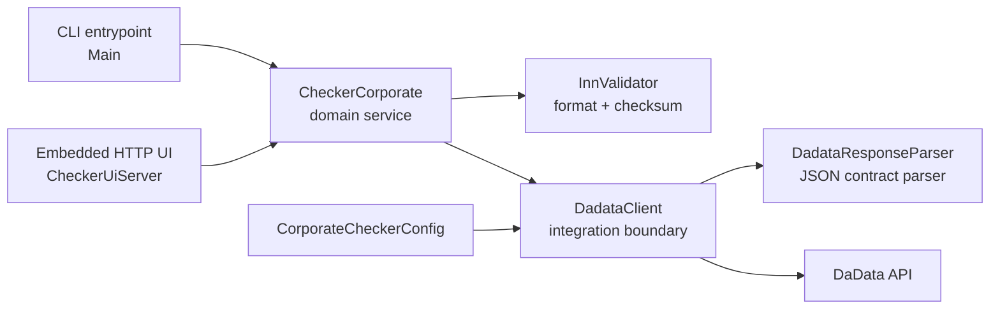

# Architecture

`Checker Corporate` is intentionally small, but it keeps production-style boundaries:

## Boundaries

- `Main` handles process mode selection only: CLI check, HTTP server, or help.
- `CheckerCorporate` owns the domain workflow: validate input, call DaData, map external status into `CheckResult`.
- `InnValidator` is deterministic and has no network or configuration dependency.
- `DadataClient` is a narrow interface that keeps tests independent from the real DaData API.
- `HttpDadataClient` owns transport concerns: endpoint, token, timeout, HTTP status handling.
- `DadataResponseParser` accepts imperfect external JSON and returns `Optional.empty()` instead of leaking parser exceptions.
- `CheckerUiServer` exposes the small browser/API surface and delegates business behavior to `CheckerCorporate`.

## Error Model

The public domain method `CheckerCorporate.check` returns explicit `CheckResult` states instead of throwing checked exceptions to callers:

- `INVALID_INPUT` for failed INN validation.
- `NOT_FOUND` for valid INN with no DaData suggestion.
- `SERVICE_UNAVAILABLE` for IO or interruption paths.
- `ACTIVE` / `NOT_ACTIVE` for mapped DaData statuses.

This keeps CLI, UI, tests, and future integrations aligned around one response contract.

## Configuration

Runtime configuration resolves in this order:

1. JVM system property.
2. Environment variable.
3. Optional `checker.properties` resource fallback.

`DADATA_TOKEN` is mandatory for real network calls. Tests inject stubs and explicit config objects to avoid hidden environment coupling.
